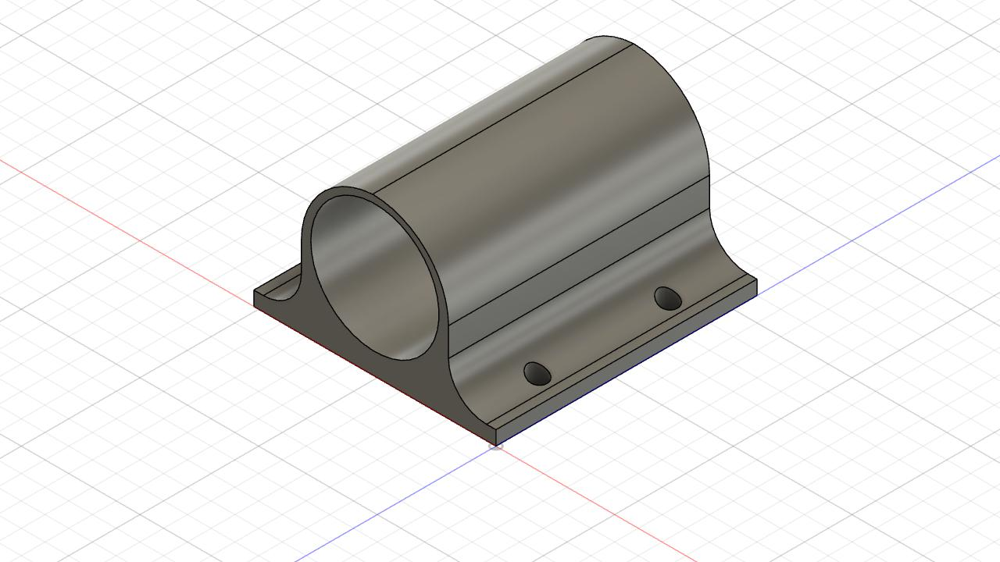

# 3d-modeling
3d modeling using Fusion 360 software

## Suporte Motor Encoder

  
  
  
  
  
  
  

## Levanta Robô

  
  
  
  
  
  
  

## Chassi Robô Sumo

  
  
  
  
  
  
  

## OBR 20 Anos de Curso

  
  
  
  
  
  
  

